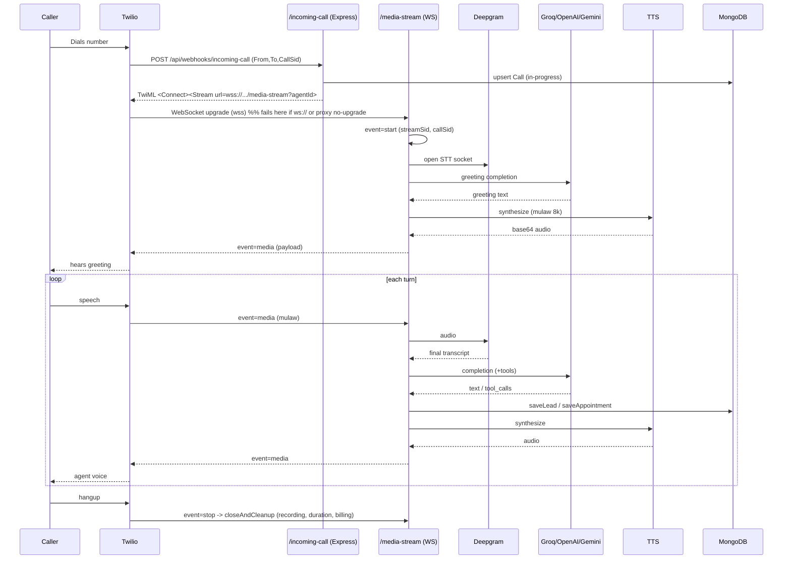
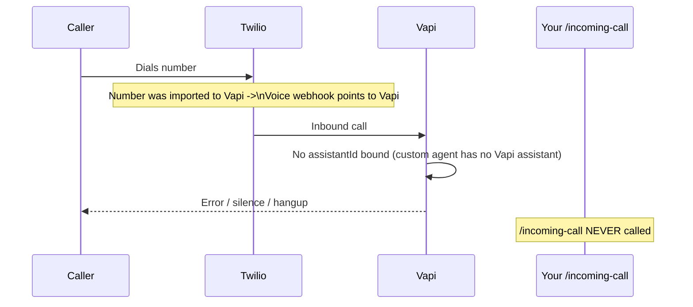
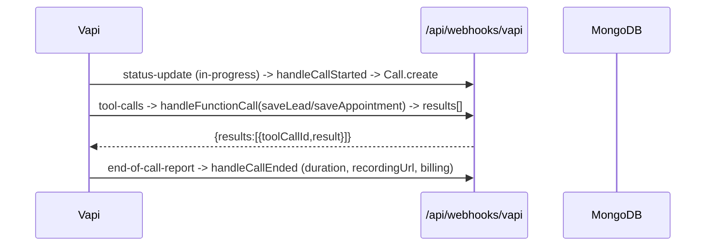

================================================================================
AUTONIV — VOICE AI ARCHITECTURE ANALYSIS
Custom Agent vs Vapi — Inbound Call Diagnosis, Architecture Comparison,
Diagrams, Debug & Deployment Checklists, Recommendation
================================================================================
Generated: 2026-07-05
Scope: backend voice pipeline (Twilio, Vapi, custom orchestrator, WebSocket)
Key source files referenced:
  - backend/services/orchestrator.js
  - backend/services/orchestratorShared.js
  - backend/routes/webhooks.js
  - backend/index.js
  - backend/db/models/Agent.js
  - backend/routes/agents.js
  - backend/services/vapi.js
  - backend/services/tts.js

================================================================================
0. EXECUTIVE SUMMARY
================================================================================
- What you BUILT for custom agents is ARCHITECTURE C
  (Twilio -> Your Backend -> Deepgram STT + Groq/OpenAI/Gemini LLM + your TTS
   -> Twilio). Vapi is NOT in the custom path at all.
- You do NOT have an Architecture B anywhere in the code.
- Your architecture is structurally CORRECT. The inbound failure is a
  PROVISIONING / ROUTING MISMATCH, not a design flaw.
- Most likely root cause: the Twilio number's Voice webhook points at VAPI
  (because numbers are imported through Vapi), so inbound calls never reach
  your /api/webhooks/incoming-call and never reach your custom orchestrator.
- Second most likely: TwiML emits ws:// instead of wss:// (Twilio Media
  Streams REQUIRE wss://).
- Third: reverse proxy not forwarding the WebSocket Upgrade for /media-stream.

================================================================================
1. WHAT YOUR CODE ACTUALLY DOES TODAY
================================================================================
You have TWO parallel, independent voice systems, selected per-agent by the
`useCustomEngine` boolean on the Agent model (Agent.js:15).

PATH 1 — VAPI AGENTS (useCustomEngine: false)
  - createVapiAssistant runs at agent creation (agents.js:258); Vapi owns the
    assistant.
  - Twilio number is provisioned THROUGH Vapi via createVapiPhoneNumber
    (vapi.js:336, agents.js:173).
  - Vapi owns the media stream, STT, LLM, TTS.
  - You only receive WEBHOOKS at POST /api/webhooks/vapi for
    call-started / call-ended / transcript / tool-calls (webhooks.js:18).

PATH 2 — CUSTOM AGENTS (useCustomEngine: true)
  - No Vapi assistant is created (agents.js:258 skips it).
  - Inbound call is supposed to hit POST /api/webhooks/incoming-call
    (webhooks.js:315), which returns TwiML:
        <Response><Connect>
          <Stream url="wss://<host>/media-stream?agentId=<id>" />
        </Connect></Response>
  - Your own WebSocketServer (orchestrator.js:127) terminates the Twilio Media
    Stream and runs, entirely on your infra:
        Deepgram STT  (orchestratorShared.js:24 createDeepgramSTT)
        Groq/OpenAI/Gemini LLM (orchestratorShared.js:113 generateCompletion)
        your TTS (tts.js synthesizeSpeech, mulaw 8k for telephony)
        your MongoDB (Call, Lead, Appointment)
        your recordings + billing (orchestratorShared.js:403 closeAndCleanup)

  => The custom agent is:
        Twilio -> Your Backend -> (Deepgram + Groq/OpenAI/Gemini + TTS) -> Twilio
     Vapi is not involved. THIS IS ARCHITECTURE C.

================================================================================
2. ARCHITECTURE COMPARISON
================================================================================
IMPORTANT TRUTH FOR ALL FOUR:
The media stream is a single duplex socket owned by exactly ONE party (Twilio's
peer). "Vapi AND my custom agent both respond" is NOT a real architecture —
whoever holds the websocket holds the mic. You choose ONE owner; the other side
can only OBSERVE (webhooks) or be DELEGATED to (HTTP). Two voices talking at
once is not a supported mode.

--------------------------------------------------------------------------------
ARCHITECTURE A — Twilio -> Vapi Assistant
--------------------------------------------------------------------------------
  Supported?            YES — first-class Vapi feature
  Recommended?          YES, when Vapi's built-in pipeline is enough
  Owns media stream     VAPI
  Owns websocket        VAPI (Twilio <-> Vapi)
  Controls conversation VAPI (STT/LLM/TTS orchestration)
  Both respond?         NO — only Vapi speaks; you observe via webhooks
  Latency               Best — single tuned vendor pipeline (~600-900 ms/turn)
  Failure points        Vapi assistant config, webhook auth, number import
  Production-ready      HIGHEST
  (This is your Path 1. Solid.)

--------------------------------------------------------------------------------
ARCHITECTURE B — Twilio -> Vapi -> Custom Agent -> OpenAI/Gemini
--------------------------------------------------------------------------------
  This is Vapi's "Custom LLM" feature: Vapi still owns Twilio's media stream,
  STT and TTS, but per turn it calls YOUR OpenAI-compatible /chat/completions
  endpoint instead of its built-in LLM.

  Supported?            YES — Vapi model.provider: "custom-llm" with a url
  Recommended?          YES if you want your own LLM/tools/DB but do NOT want
                        to run the media plane
  Owns media stream     VAPI
  Owns websocket        VAPI (Twilio <-> Vapi). Your side is plain HTTPS
                        request/response, NOT a websocket
  Controls conversation SHARED — Vapi drives turns/interruption/endpointing;
                        your LLM decides words + tool calls
  Both respond?         Effectively no — your LLM produces text, Vapi speaks it
  Latency               Very good — Vapi media plane + one hop to your LLM
                        (~800 ms - 1.1 s/turn)
  Failure points        Your endpoint latency/SSE format, tool schema, timeouts
  Production-ready      HIGH — you own brains, Vapi owns ears/mouth

  YOU ARE NOT RUNNING THIS. Your customEngineModel calls Groq/OpenAI/Gemini
  directly from YOUR server (orchestratorShared.js:113) and Twilio streams to
  YOU — that is C, not B.

--------------------------------------------------------------------------------
ARCHITECTURE C — Twilio -> Custom Backend -> OpenAI Realtime (no Vapi)
--------------------------------------------------------------------------------
  This is WHAT YOU ACTUALLY BUILT, except you use Deepgram STT +
  Groq/OpenAI/Gemini + your TTS instead of OpenAI Realtime.

  Supported?            YES — Twilio Media Streams <Connect><Stream> is native
  Recommended?          ONLY if you need full control and can operate the
                        media plane
  Owns media stream     YOU (handleTwilioStream, orchestrator.js:147)
  Owns websocket        YOU (WebSocketServer, orchestrator.js:127)
  Controls conversation YOU — 100%
  Both respond?         Only you (Vapi absent)
  Latency               Highest risk — you chain STT->LLM->TTS yourself; every
                        hop, barge-in, endpointing, mulaw is yours to optimize
  Failure points        MANY — wss/TLS, proxy upgrade, mulaw encoding,
                        endpointing, TTS format, key mgmt
  Production-ready      POSSIBLE but you own every millisecond and every outage

--------------------------------------------------------------------------------
ARCHITECTURE D — Twilio -> Vapi Workflow -> Custom Agent -> Vapi -> User
--------------------------------------------------------------------------------
  Supported?            PARTIALLY — Vapi Workflows exist; "hand back to Vapi to
                        speak" = the Custom-LLM/tool pattern, not a separate
                        agent taking the mic
  Recommended?          NO — overcomplicated for most cases
  Owns media stream     VAPI
  Owns websocket        VAPI
  Controls conversation VAPI workflow engine, delegating steps to you
  Both respond?         Sequential handoff only, never simultaneously
  Latency               Worst — multiple hops Vapi<->you<->Vapi per turn
  Failure points        Workflow state, handoff, double webhook surface
  Production-ready      NICHE

================================================================================
3. WHY YOUR INBOUND CUSTOM-AGENT CALL FAILS (RANKED)
================================================================================
1) TWILIO NUMBER'S VOICE WEBHOOK POINTS AT VAPI, NOT /incoming-call  [MOST LIKELY]
   Numbers are created through createVapiPhoneNumber (agents.js:173, vapi.js:336).
   Importing a number into Vapi rewrites Twilio's Voice URL to Vapi's endpoint.
   So inbound goes Twilio -> Vapi. For a useCustomEngine agent there is NO Vapi
   assistant (agents.js:258 skips creation) and no assistantId bound to the
   number -> Vapi answers and fails/hangs. Your /api/webhooks/incoming-call
   (webhooks.js:315) is NEVER invoked. No code anywhere sets a Twilio number's
   Voice webhook to /api/webhooks/incoming-call.
   FIX: For custom-engine agents, the number must be a PLAIN Twilio number whose
   Voice webhook = https://<backend>/api/webhooks/incoming-call. Do NOT import
   that number into Vapi.

2) ws:// EMITTED INSTEAD OF wss://  [VERY LIKELY]
   webhooks.js:381:
     const protocol = req.headers['x-forwarded-proto'] === 'https' ? 'wss' : 'ws';
   Twilio Media Streams REQUIRE wss://. This exact-match check fails when:
     - trust proxy is off (only enabled in production, index.js:47)
     - proxy sends x-forwarded-proto: "https,http"
     - you test without HTTPS
   Result: TwiML contains ws://... -> Twilio refuses the stream -> call drops.

3) REVERSE PROXY / HOST NOT UPGRADING THE WEBSOCKET
   new WebSocketServer({ server }) (orchestrator.js:127) attaches to the raw HTTP
   server, but nginx / ALB / Cloudflare must forward Upgrade / Connection:
   upgrade for /media-stream. A missing proxy_set_header Upgrade (or Cloudflare
   proxy) silently 404s the handshake.

4) TLS CERT NOT CA-VALID
   Twilio rejects self-signed / expired certs on the wss endpoint. ngrok /
   managed certs are fine.

5) PUBLIC REACHABILITY
   If the backend isn't reachable from the internet at the exact host in
   req.headers.host, the <Stream url> is unreachable.

6) STT/TTS MISCONFIG (call connects but "fails" functionally)
   - Missing DEEPGRAM_API_KEY -> createDeepgramSTT rejects
     (orchestratorShared.js:26) -> greeting plays, then dead air.
   - TTS returning non-mulaw for isTwilio=true -> caller hears static
     (tts.js:241).

================================================================================
4. DIAGRAMS
================================================================================

4.1 ARCHITECTURE (CUSTOM PATH, CURRENT)
--------------------------------------------------------------------------------
   PSTN            Twilio Voice           Your Node backend                 Vendors
  +----+  call    +----------+  POST     +----------------------------+
  |User|--------->|  Twilio  |---------> | /api/webhooks/incoming-call|
  +----+          |  Number  |  TwiML <--|  returns <Connect><Stream> |
    ^             +----+-----+           +--------------+-------------+
    |                  | wss Media Stream               |
    |   mulaw audio    |  (8k mulaw)                    v
    |<-----------------+--------------> +----------------------------+  ws   +----------+
    |                  +--------------->|  WebSocketServer           |------>| Deepgram | STT
    |                                   |  /media-stream (orchestr.  |<------+----------+
    |                                   |  handleTwilioStream)       |  http +----------+
    |                                   |   |- conversationHistory   |------>|Groq/OpenAI| LLM
    |                                   |   |- tools (saveLead...)   |<------|  /Gemini |
    |                                   |   |- TTS -> mulaw base64   |  http +----------+
    |                                   |                            |------>|   TTS    |
    |                                   +-------------+--------------+<------+----------+
    |                                                 v
    |                                       MongoDB (Call, Lead,
    |                                       Appointment) + /recordings

4.2 SEQUENCE — INBOUND CUSTOM CALL (TARGET FLOW)  [Mermaid]
--------------------------------------------------------------------------------

4.3 SEQUENCE — WHERE IT FAILS TODAY  [Mermaid]
--------------------------------------------------------------------------------

4.4 VAPI WEBHOOK FLOW (PATH 1, WORKING)  [Mermaid]
--------------------------------------------------------------------------------

4.5 NETWORK FLOW (CUSTOM PATH)
--------------------------------------------------------------------------------
  Caller PSTN
     |  (SIP/PSTN, Twilio-managed)
  Twilio Media Edge
     |  1) HTTPS POST  -> https://<backend>/api/webhooks/incoming-call
     |  2) WSS         -> wss://<backend>/media-stream?agentId=<id>
  Reverse proxy (nginx/ALB/Cloudflare)   [MUST forward Upgrade/Connection]
     |
  Node HTTP server (index.js:147)  + WebSocketServer (orchestrator.js:127)
     |  outbound WSS  -> wss://api.deepgram.com/v1/listen        (STT)
     |  outbound HTTPS-> api.groq.com / api.openai.com / gemini  (LLM)
     |  outbound HTTPS-> TTS provider                            (TTS)
     |  local/driver  -> MongoDB                                 (state)
     |  local FS      -> ./recordings/<callSid>.wav              (recording)

4.6 REQUEST / RESPONSE FLOW (TwiML handshake)
--------------------------------------------------------------------------------
  REQUEST  (Twilio -> you), application/x-www-form-urlencoded:
      From=+1XXXXXXXXXX
      To=+1YYYYYYYYYY
      CallSid=CAxxxxxxxx
      Direction=inbound
  RESPONSE (you -> Twilio), text/xml:
      <?xml version="1.0" encoding="UTF-8"?>
      <Response>
        <Connect>
          <Stream url="wss://<host>/media-stream?agentId=<id>" />
        </Connect>
      </Response>

  Then over the WSS Media Stream (JSON frames):
      {"event":"start","start":{"streamSid":"...","callSid":"..."}}
      {"event":"media","media":{"payload":"<base64 mulaw>"}}   (both directions)
      {"event":"clear","streamSid":"..."}   (barge-in interrupt, you -> Twilio)
      {"event":"stop"}

4.7 WEBHOOK FLOW (BOTH PATHS)
--------------------------------------------------------------------------------
  CUSTOM PATH:
    POST /api/webhooks/incoming-call   (Twilio Voice webhook -> TwiML)
    WSS  /media-stream                 (Twilio Media Stream)

  VAPI PATH:
    POST /api/webhooks/vapi            (single endpoint, event-typed)
      - status-update (in-progress) -> handleCallStarted
      - call-started                -> handleCallStarted
      - end-of-call-report          -> handleCallEnded
      - transcript                  -> handleTranscript
      - function-call / tool-calls  -> handleFunctionCall (saveLead / saveAppointment)

================================================================================
5. DEBUG CHECKLIST (CUSTOM INBOUND)
================================================================================
[ ] 1. Twilio Console -> the number -> Voice Configuration:
       "A call comes in" = Webhook, HTTP POST,
       https://<backend>/api/webhooks/incoming-call
       If it shows a Vapi URL -> that is root-cause #1.

[ ] 2. Test the route manually:
       curl -X POST https://<backend>/api/webhooks/incoming-call \
            -d "From=+1555&To=<yournum>&CallSid=TEST"
       Confirm you receive <Connect><Stream url="wss://...">.
       ASSERT the scheme is wss NOT ws.

[ ] 3. If it is ws:// -> set TRUST_PROXY=true and confirm the proxy sends a
       single x-forwarded-proto: https. Consider forcing wss when
       NODE_ENV=production.

[ ] 4. WebSocket upgrade test from OUTSIDE your network:
       wscat -c "wss://<backend>/media-stream?agentId=<id>"
       Should connect (not 404 / close 4004). Failure -> proxy not upgrading.

[ ] 5. TLS:
       curl -vI https://<backend>
       Valid CA chain, not expired, not self-signed.

[ ] 6. Server logs during a live call, expected order:
       twilio_incoming_call
       -> [Twilio WS] Stream connection established
       -> event=start
       -> [Deepgram STT] Connection established
       -> Playing greeting
       Whichever line is missing localizes the break.

[ ] 7. Keys: DEEPGRAM_API_KEY, and one of GROQ/OPENAI/GEMINI — none set to a
       "your-..." placeholder (orchestratorShared.js:26, :94).

[ ] 8. agentId resolution: resolved agent.phoneNumber actually matches dialed
       To (webhooks.js:326 fuzzy match) and useCustomEngine: true.

[ ] 9. Audio format: greeting audible? If static -> TTS not returning mulaw 8k
       for isTwilio=true (tts.js:241).

[ ] 10. WS close codes: 4004 = path wrong, 4000/4001 = agentId missing/not found.

================================================================================
6. PRODUCTION DEPLOYMENT CHECKLIST
================================================================================
[ ] Custom-engine numbers are PLAIN Twilio numbers, Voice webhook ->
    /api/webhooks/incoming-call; Vapi numbers stay in Vapi. Never mix per number.
[ ] Force wss:// in prod; app.set('trust proxy', 1) on (already gated to prod).
[ ] Reverse proxy forwards WS upgrade for /media-stream and /web-call:
      proxy_set_header Upgrade $http_upgrade;
      proxy_set_header Connection "upgrade";
    No idle-timeout shorter than call length.
[ ] Valid TLS cert; HTTP->HTTPS redirect must NOT catch the webhook POST.
[ ] Sign-verify Twilio requests (X-Twilio-Signature) — /incoming-call is
    currently unauthenticated.
[ ] Sticky sessions / single-node or shared state — the WS conversation is
    in-memory per process; behind multiple nodes the same call must stay on one
    node.
[ ] Secrets present and non-placeholder; twilioAuthToken decrypted correctly
    (agents.js:34).
[ ] Recordings dir writable & persistent (closeAndCleanup writes
    recordings/*.wav); on ephemeral disks move to S3.
[ ] Barge-in / endpointing tuned (endpointing=200, utterance_end_ms=1000,
    orchestratorShared.js:32).
[ ] Concurrency: LLM/TTS/Deepgram rate limits at expected simultaneous calls.
[ ] Health checks + alerting on the WS handshake and per-turn latency.

================================================================================
7. IS YOUR ARCHITECTURE FUNDAMENTALLY CORRECT?
================================================================================
YES, structurally — but you built C while (likely) provisioning numbers as if
you were doing A/B, and that is the conflict. Twilio -> Your Backend ->
(Deepgram + LLM + TTS) -> Twilio is a valid, production-proven pattern. Nothing
about it is wrong. The failure is a PROVISIONING/ROUTING MISMATCH, not a design
flaw: the number that should ring your /media-stream orchestrator is being
answered by Vapi.

================================================================================
8. RECOMMENDED ARCHITECTURE
================================================================================
Don't try to make Vapi and your custom agent share one call. Pick per agent,
cleanly:

- DEFAULT / most agents -> ARCHITECTURE A (Twilio -> Vapi Assistant).
  Lowest latency, least ops; your /api/webhooks/vapi plumbing already works.

- WHEN you truly need your own LLM/tools/DB but NOT the media plane ->
  MIGRATE Path 2 to ARCHITECTURE B (Vapi Custom-LLM: point Vapi's model.url at
  an OpenAI-compatible endpoint you expose, reusing generateCompletion). You
  keep brains + tools + Mongo; Vapi solves the hard real-time media problems
  (barge-in, mulaw, endpointing, TLS/wss, scaling) — the exact things breaking
  your C path.

- KEEP ARCHITECTURE C ONLY IF you have a hard requirement Vapi can't meet
  (specific STT/TTS vendor, on-prem, cost at scale). If you keep it, fix number
  provisioning + wss + proxy-upgrade above and treat the media plane as a
  first-class system you operate.

- RESERVE D — it adds hops and failure surface without giving you anything A or
  B don't.

================================================================================
9. NEXT ACTIONS I CAN TAKE (ON REQUEST)
================================================================================
(a) Add a useCustomEngine branch + wss hardening to /incoming-call.
(b) Add Twilio signature verification (X-Twilio-Signature).
(c) Scaffold the Architecture-B custom-LLM endpoint reusing existing
    generateCompletion / tools.

================================================================================
END OF DOCUMENT
================================================================================
